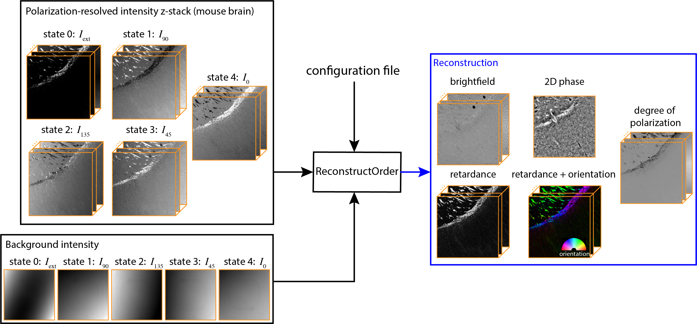

# ReconstructOrder

Analyze density (bright-field, phase), anisotropy (birefringence, slow axis), and degree of polarization of specimens from polarization-resolved and depth-resolved images. The acquisition, calibration, background correction, and reconstruction algorithms are described in the following preprint:

Guo, S.-M., Yeh, L.-H., Folkesson, J.,..., Mehta, S. B. (2019). [Revealing architectural order with quantitative label-free imaging and deep learning.](https://doi.org/10.1101/631101) BioRxiv 631101.

As an illustration, following figure shows inputs and outputs of the ReconstructOrder for polarization-resolved data acquired at 21 consecutive focal planes with 2D phase reconstruction algorithm.



ReconstructOrder currently supports data format acquired using Micro-Manager 1.4.22 multi-dimension acquisition ([link](https://micro-manager.org/)) and OpenPolScope acquisition plugin ([link](https://openpolscope.org/)). We will add support for Micro-Manager 2.0 format in the next release.

## Installation

### Create a new conda environment (optional, but recommended)
>Install conda package management system by installing anaconda or miniconda ([link](https://conda.io/)). 
>Creating a conda environment dedicated to ReconstructOrder will avoid version conflicts among packages required by ReconstructOrder and packages required by other python software.
>
>```buildoutcfg
>conda create -n <your-environment-name> python=3.7
>conda activate <your-environment-name>
>```

#### All code blocks below assume you are in the above environment

### Option 1: install released version via pip
>ReconstructOrder is available on pip.  Running pip install will also install dependencies.
>From your environment created above, type:
>```buildoutcfg
>pip install ReconstructOrder
>```

### Option 2: install developer version via git
>Install the git version control system git : [link](https://git-scm.com/book/en/v2/Getting-Started-Installing-Git)
>
>Use git to clone this repository to your current directory:
>```buildoutcfg
>git clone https://github.com/mehta-lab/reconstruct-order.git
>```
You cab install dependencies via pip (python index package) or run ReconstructOrder inside a docker container with the dependencies pre-installed
> * #### install dependencies via pip
>  
>>    If you are running ReconstructOrder on your own machine, <br>
>>
>>    a) navigate to the cloned repository:
>>
>>    ```buildoutcfg
>>    cd reconstruct-order
>>    ```
>>    <br>
>>    b) install python library dependencies:
>>
>>    ```buildoutcfg
>>    pip install -r requirements.txt
>>    ```
>>    <br>
>>    c) Create a symbolic library link with setup.py:
>>
>>    ```buildoutcfg
>>    python setup.py develop
>>    ```

> * #### Running inside a docker container
>
> If you are running ReconstructOrder on a compute node (e.g., fry2@czbiohub), it is recommended to run it in 
> a Docker container. 
> Docker is the virtual environment with all the required libraries pre-installed so you can run your copy of 
> ReconstructOrder without recreating the environment.
> The docker image for ReconstructOrder has been built on fry2@czbiohub. 
> If you are running ReconstructOrder on other servers, you can build the docker image after cloning the repository 
> by doing :    

>>    ```buildoutcfg
>>    docker build -t reconstruct_order:py37 -f Dockerfile.ReconstructOrder .
>>    ```

>>    Now, to start a docker container, do 
>>    ```buildoutcfg
>>    docker run -it  -v /data/<your data dir>/:<data dir name inside docker>/ -v ~/ReconstructOrder:/ReconstructOrder reconstruct_order:py37 bash
>>    ```


*ReconstructOrder supports NVIDIA GPU computation through cupy package, please follow [here](https://github.com/cupy/cupy) for installation (check cupy is properly installed by ```import cupy```). To enable gpu processing, set ```processing: use_gpu: True``` in the configuration file.*

## Usage
>The reconstruction parameters are specified in the configuration file.  
> Configuration file template(```config_example.yml```) can be found [here](https://github.com/mehta-lab/reconstruct-order) under ```examples``` folder, which incluides detailed explanation of parameters for running ReconstructOrder in different modes
>
> To use the configuration file template for your data, you need to at least modify ```dataset: data_dir``` and ```dataset: processed_dir``` to point to source data path and output path. See the template docstrings for the usage of other parameters.
>
> #### There are two ways to run reconstruction:
>>* #### from command line
>>   If you pip installed the library, from any folder, simply type:
>>   ```buildoutcfg
>>   runReconstruction --config path-and-name-to-your-config.yml
>>   ```
>>
>>   or 
>>   ```buildoutcfg
>>   python runReconstruction.py --config path-and-name-to-your-config.yml
>>   ```
>>   if you the symlink wasn't set up. 
>
>>* #### Inside Python scripts 
>>   To call ReconstructOrder as a library in your own script to run reconstruction:
>>   ```buildoutcfg
>>   import ReconstructOrder.workflow as wf
>>   wf.reconstruct_batch('path-and-name-to-your-config.yml')
>>   ```

## Example
In the following, we demonstrate how to download our example dataset (hosted [here](https://drive.google.com/drive/u/3/folders/1axmPgQVNi22ZqGLXzHGHIuP9kA93K9zH)) and run ReconstructOrder on it to get birefringence and phase images. This instruction should work for installation from both Option 1 and 2. <br>

a) In the terminal, switch to the environment with ReconstructOrder installed 
>  ```buildoutcfg
>  conda activate <your-environment-name>
>  ```

b) Navigate to the repository folder:
>  ```buildoutcfg
>  cd reconstruct-order
>  ```

c) Download example dataset:
>  ```buildoutcfg
>  python DownloadExample.py

The example datasets will be downloaded and upzipped in the ```data_downloaded``` folder, together with the configuration files. <br>

d) Run ReconstructOrder on the downloaded dataset, e.g. MouseBrain dataset:
>   ```buildoutcfg
>  python runReconstruction.py --config ./data_downloaded/MouseBrain/config.yml
    
e) The reconstructed images will be saved the ```data_downloaded``` folder. You can reconstruct other downloaded datasets following the above steps, or change the parameters in the configuration file and observe the changes in the output images.
    
## License
Chan Zuckerberg Biohub Software License

This software license is the 2-clause BSD license plus clause a third clause
that prohibits redistribution and use for commercial purposes without further
permission.

Copyright © 2019. Chan Zuckerberg Biohub.
All rights reserved.

Redistribution and use in source and binary forms, with or without
modification, are permitted provided that the following conditions are met:

1.	Redistributions of source code must retain the above copyright notice,
this list of conditions and the following disclaimer.

2.	Redistributions in binary form must reproduce the above copyright notice,
this list of conditions and the following disclaimer in the documentation
and/or other materials provided with the distribution.

3.	Redistributions and use for commercial purposes are not permitted without
the Chan Zuckerberg Biohub's written permission. For purposes of this license,
commercial purposes are the incorporation of the Chan Zuckerberg Biohub's
software into anything for which you will charge fees or other compensation or
use of the software to perform a commercial service for a third party.
Contact ip@czbiohub.org for commercial licensing opportunities.

THIS SOFTWARE IS PROVIDED BY THE COPYRIGHT HOLDERS AND CONTRIBUTORS "AS IS"
AND ANY EXPRESS OR IMPLIED WARRANTIES, INCLUDING, BUT NOT LIMITED TO, THE
IMPLIED WARRANTIES OF MERCHANTABILITY AND FITNESS FOR A PARTICULAR PURPOSE ARE
DISCLAIMED. IN NO EVENT SHALL THE COPYRIGHT HOLDER OR CONTRIBUTORS BE LIABLE
FOR ANY DIRECT, INDIRECT, INCIDENTAL, SPECIAL, EXEMPLARY, OR CONSEQUENTIAL
DAMAGES (INCLUDING, BUT NOT LIMITED TO, PROCUREMENT OF SUBSTITUTE GOODS OR
SERVICES; LOSS OF USE, DATA, OR PROFITS; OR BUSINESS INTERRUPTION) HOWEVER
CAUSED AND ON ANY THEORY OF LIABILITY, WHETHER IN CONTRACT, STRICT LIABILITY,
OR TORT (INCLUDING NEGLIGENCE OR OTHERWISE) ARISING IN ANY WAY OUT OF THE USE
OF THIS SOFTWARE, EVEN IF ADVISED OF THE POSSIBILITY OF SUCH DAMAGE. 
